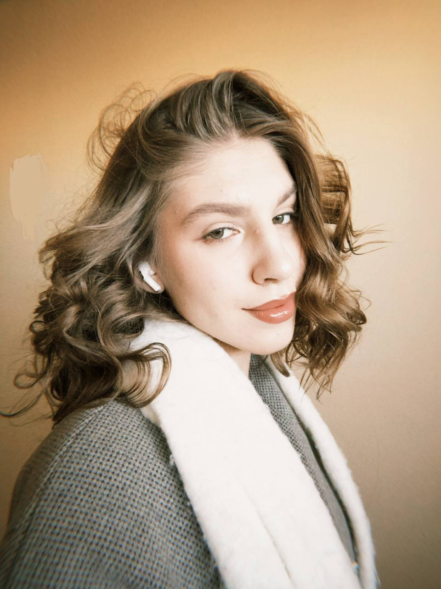
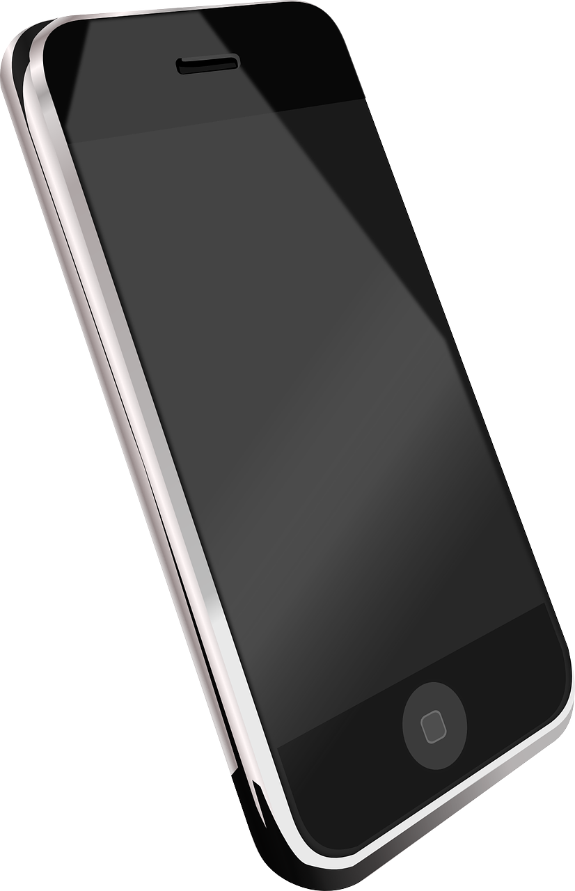

# Юрчик Софья 

## Студентка Белорусско-Российского университета

### Навигация
- [Образование](#образование)
- [Навыки](#навыки)
- [Обо мне](#Обо_мне)



### Контактная информация  
<p> <a href="tel:+375255148174">+375(25)514-81-74</a></p>
<p> Sfrnv.s</p>
<p> г.Брест, ул.Криштофовича д.10, кв.33</p>
<p> Yurchiksophiya@gmail.com</p>

---

## Навыки  
-  Люблю читать книги  
-  Гоняю на велике  
-  Вяжу спицами  
-  Уровень английского - B1  

---

## Обо мне  
- Ответственна, неконфликтна, начитанна, честна, трудолюбива  

---

## Образование  
1. **Средняя школа №14 имени Е.М.Фомина** (г. Брест) – 1-9 класс  
2. **Областной лицей имени Машерова** (г. Брест) – 10-11 класс, профиль: химико-технологический  
3. **Белорусско-Российский университет** – специальность: Прикладная математика (2 курс)  

---

## Цитата
> *"Занимайся жизнью или занимайся смертью" (Побег из Шоушенка).*

---

## 💻 Код (Пример)

```javascript
function sayHello() {
    alert("Привет, пирожочки!");
}
sayHello();

